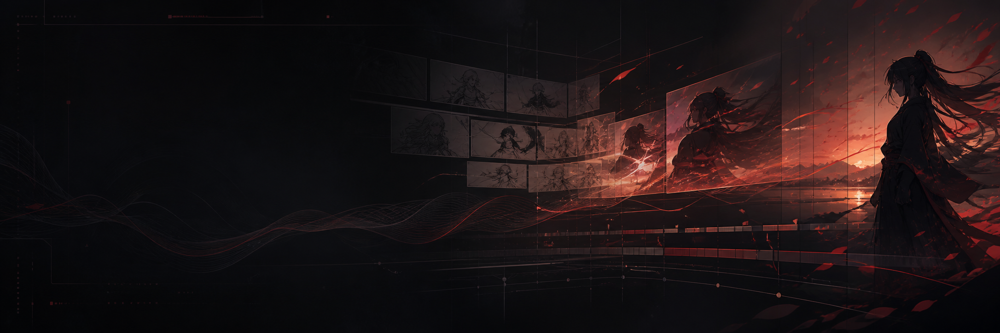

<p align="center">
  
</p>

<h1 align="center">SELMA Labs</h1>

<p align="center">
  <strong>Local-first AI video production with character continuity, human approval gates, and reproducible rendering.</strong>
</p>

<p align="center">
  <a href="https://github.com/Kerem-1903/Selma-Labs/actions/workflows/quality-gates.yml"></a>
  <a href="https://github.com/Kerem-1903/Selma-Labs/actions/workflows/codeql.yml"></a>
  <a href="LICENSE"></a>
  
  
  
  
</p>

<p align="center">
  <a href="README.tr.md">Türkçe</a> ·
  <a href="docs/README.md">Documentation</a> ·
  <a href="RUNBOOK.md">Runbook</a> ·
  <a href="docs/A8_1_PILOT_PRODUCTION.md">Pilot production</a>
</p>

---

SELMA Labs is an experimental production system for turning a topic, script, or
licensed audio track into a reviewable YouTube-ready video package. It combines
provider-independent domain logic with local media tools, explicit quality
gates, durable checkpoints, and human approval before generated character media
can move downstream.

The current milestone is an original 2–3 minute pilot built around **Akira**, a
multi-view character reference pack, approved keyframes, local image-to-video
generation, and FFmpeg assembly.

## Why SELMA Labs

Most AI-video demos optimize for one successful generation. SELMA Labs treats
the complete production process as the product:

- **Continuity first:** character state, wardrobe, props, injuries, locations,
  and references are modeled explicitly.
- **Human approval is structural:** only committed keyframes can become motion;
  only approved motion clips can enter an assembly.
- **Local-first production:** ComfyUI, AnimateDiff, FFmpeg, and Remotion can run
  on the creator's machine.
- **Provider boundaries:** generation, storage, rendering, search, and voice
  integrations sit behind ports rather than leaking into domain logic.
- **Fail-closed quality:** unsupported facts, unsafe assets, missing rights,
  invalid references, and failed media checks block publication.
- **Reproducible attempts:** seeds, render profiles, duration, failures,
  retries, and estimated GPU cost are persisted.

## Production flow


## Current capabilities

| Area | What is implemented |
|---|---|
| Story and research | Source-grounded fact checks, bounded rewrites, narrative contracts, hook and payoff gates |
| Continuity | Event-sourced character, outfit, object, injury, and location state |
| Character references | Portable multi-view Character Bible assets with revision and SHA-256 verification |
| Keyframes | Shot-contract-driven candidates, ComfyUI support, IP-Adapter, OpenPose, and optional Character LoRA |
| Human review | Candidate approval, immutable commit boundary, and rejected-candidate protection |
| Motion | Approved-keyframe-only image-to-video generation with render profiles and transient retry rules |
| Editing | Remotion creative composition plus FFmpeg normalization, assembly, and mastering |
| Quality | Vision gates, asset diversity, caption safety, black/freeze/silence/loudness checks, and rights metadata |
| Delivery | Checkpoint resume, YouTube package generation, captions, metadata, reports, and thumbnail candidates |

## Verified baseline

- **645 automated tests passing**
- Real FFmpeg integration coverage
- GitHub Actions quality gates for Python and Remotion
- Local ComfyUI keyframe and AnimateDiff image-to-video paths
- Five-view Akira Character Bible: front, left three-quarter, left profile,
  back, and face close-up

Provider-backed creative output still requires the relevant local models,
licensed inputs, and API credentials. Tests use fakes where network access or
paid providers are not required.

## Quick start

### Requirements

- Python 3.10 or newer
- FFmpeg and FFprobe available on `PATH`
- Node.js 22 and npm for Remotion work
- Optional: ComfyUI with the required custom nodes and local models

### Install

```bash
git clone https://github.com/Kerem-1903/Selma-Labs.git
cd Selma-Labs
python -m venv .venv
```

Activate the environment:

```powershell
# Windows PowerShell
.\.venv\Scripts\Activate.ps1
```

```bash
# macOS / Linux
source .venv/bin/activate
```

Install dependencies and create local configuration:

```bash
python -m pip install --upgrade pip
python -m pip install -r requirements.txt
cp .env.example .env
```

On Windows, use `Copy-Item .env.example .env` instead of `cp` if needed.

### Verify the workspace

```bash
python scripts/system_health.py --profile factory
python -m pytest tests -q
```

### Run the factory

```bash
python scripts/run_factory.py \
  --topic "Why do octopuses have three hearts?" \
  --language en \
  --duration-seconds 30
```

Or start from a licensed local audio file:

```bash
python scripts/run_factory.py --audio-path ./input_audio/example.wav
```

The factory performs a secret-free preflight before constructing paid
providers. See [.env.example](.env.example) for provider switches and
[RUNBOOK.md](RUNBOOK.md) for operational setup.

## Akira reference pack

The approved model sheet is split deterministically into five storage-backed
assets. Character Bible metadata contains portable storage keys rather than
machine-specific absolute paths.

```bash
python scripts/import_akira_reference_pack.py \
  --source assets/references/akira/akira-multiview-reference-v1.png \
  --storage-root assets \
  --bible-root assets/character_bibles
```

Re-importing identical content is idempotent; a changed view creates a new
revision without overwriting the previous asset.

## Repository map

```text
core/             Domain entities, value objects, ports, and application services
infrastructure/   Provider, repository, storage, and media adapters
config/           Environment-driven settings and provider composition
cli/              Character inspection, script breakdown, and approved-shot commands
scripts/          Production, validation, smoke-test, and maintenance commands
tests/            Unit, integration, end-to-end, and performance coverage
motion/           Remotion compositions and TypeScript assets
assets/           Versioned workflows, references, brand, music, and SFX metadata
docs/             Architecture, production, quality, and historical documentation
```

## Documentation

Start with the [documentation index](docs/README.md). Key references:

- [Autonomous studio architecture](AUTONOMOUS_STUDIO_ARCHITECTURE.md)
- [Approved keyframe-to-motion workflow](docs/A8_APPROVED_KEYFRAME_MOTION.md)
- [Pilot production and FFmpeg assembly](docs/A8_1_PILOT_PRODUCTION.md)
- [Character LoRA dataset safeguards](docs/CHARACTER_LORA_DATASET.md)
- [Source-control safety](docs/SOURCE_CONTROL_SAFETY.md)
- [Operational runbook](RUNBOOK.md)
- [Historical sprint record](docs/sprint-history/PROJECT_HISTORY.md)

## Production principles

1. Never bypass a human approval boundary.
2. Keep filesystem paths out of persisted portable metadata.
3. Retry only transient provider failures.
4. Run a draft validation before long or expensive renders.
5. Persist real render duration and estimated cost.
6. Require source and rights evidence for publishable media.
7. Treat synthetic-content disclosure as part of delivery.

## Project status

SELMA Labs is under active development. The next production target is the
original **Kırık Kayıt** pilot: approximately 15 shots, a small set of polished
AI-motion scenes, controlled motion-comic coverage, human review at every media
boundary, and a 1080p/24 FPS post-production master.

## Contributing and support

Contributions are welcome. Read [CONTRIBUTING.md](CONTRIBUTING.md) before
opening a pull request, use the structured issue forms for public reports, and
follow the [Code of Conduct](CODE_OF_CONDUCT.md). Security vulnerabilities must
be reported privately according to [SECURITY.md](SECURITY.md).

SELMA Labs is available under the [Apache License 2.0](LICENSE).

## Two-pass anime pipeline

The anime production boundary keeps script interpretation, character identity,
motion generation, lip sync, and composition separate:

```text
script lines -> unapproved shot plans -> human-approved keyframes
             -> ComfyUI motion pass 1 -> identity refinement pass 2
             -> LivePortrait boundary -> FFmpeg layered composition
```

Akira's canonical identity is exposed by `CharacterBible.akira()`. Motion and
lip-sync engines implement domain ports, while `config/container.py` selects
the local adapters and injects environment-driven settings. The current
LivePortrait adapter is an explicit, deterministic passthrough mock; it does
not claim to perform real mouth animation.

Inspect the character or break down a UTF-8 script without starting ComfyUI:

```bash
python -m cli.main character show
python -m cli.main script breakdown --input story.txt --output shot-plan.json
```

Rendering accepts only a shot plan whose keyframe matches the candidate stored
as `COMMITTED` by the A7 human-review workflow. Its image, background, and audio
must use portable storage keys. ComfyUI/model locations come from environment
settings rather than code.
