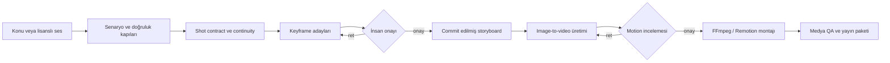

<p align="center">
  
</p>

<h1 align="center">SELMA Labs</h1>

<p align="center">
  <strong>Karakter tutarlılığı, insan onay kapıları ve yeniden üretilebilir render süreci sunan yerel öncelikli AI video stüdyosu.</strong>
</p>

<p align="center">
  <a href="https://github.com/Kerem-1903/Selma-Labs/actions/workflows/quality-gates.yml"></a>
  <a href="LICENSE"></a>
  
  
  
  
</p>

<p align="center">
  <a href="README.md">English</a> ·
  <a href="docs/README.md">Dokümantasyon</a> ·
  <a href="docs/operations/runbook.md">Operasyon rehberi</a> ·
  <a href="docs/project/roadmap.md">Yol haritası</a> ·
  <a href="docs/A8_1_PILOT_PRODUCTION.md">Pilot üretimi</a>
</p>

---

SELMA Labs; bir konu, senaryo veya lisanslı ses kaydını incelenebilir ve
YouTube'a hazır bir video paketine dönüştürmek için geliştirilen deneysel bir
üretim sistemidir. Provider bağımsız domain mantığını yerel medya araçları,
kalıcı checkpoint'ler, kalite kapıları ve zorunlu insan onayıyla birleştirir.

Güncel hedef; **Akira** karakteri için çok açılı referans paketi, onaylı
keyframe'ler, yerel image-to-video üretimi ve FFmpeg montajı kullanan özgün,
2–3 dakikalık bir pilot bölümdür.

## SELMA Labs neden farklı?

Çoğu AI video demosu tek bir başarılı üretime odaklanır. SELMA Labs ise tüm
üretim sürecini ürünün kendisi olarak ele alır:

- **Önce tutarlılık:** Karakter durumu, kıyafet, eşya, yara, mekân ve referanslar
  açık domain modelleriyle takip edilir.
- **İnsan onayı yapısaldır:** Yalnızca commit edilmiş keyframe motion'a,
  yalnızca onaylanmış motion klibi montaja girebilir.
- **Yerel öncelikli üretim:** ComfyUI, AnimateDiff, FFmpeg ve Remotion içerik
  üreticisinin kendi makinesinde çalışabilir.
- **Provider sınırları:** Üretim, storage, render, arama ve ses servisleri domain
  katmanına sızmayan port'ların arkasındadır.
- **Fail-closed kalite:** Desteksiz bilgi, güvensiz asset, eksik lisans,
  geçersiz referans veya başarısız medya kontrolü yayını durdurur.
- **İzlenebilir denemeler:** Seed, render profili, süre, hata, retry ve tahmini
  GPU maliyeti kalıcı kaydedilir.

## Üretim akışı



## Güncel yetenekler

| Alan | Uygulanan özellikler |
|---|---|
| Hikâye ve araştırma | Kaynak destekli doğruluk kontrolü, sınırlı rewrite, narrative contract, hook ve payoff kapıları |
| Continuity | Event-sourced karakter, kıyafet, eşya, yara ve mekân durumu |
| Karakter referansları | Revision ve SHA-256 doğrulamalı portable Character Bible asset'leri |
| Keyframe | ShotContract tabanlı adaylar, ComfyUI, IP-Adapter, OpenPose ve isteğe bağlı Character LoRA |
| İnsan incelemesi | Aday onayı, değiştirilemez commit sınırı ve reddedilen aday koruması |
| Motion | Render profilleri ve yalnızca geçici hatalarda retry kullanan approved-keyframe image-to-video üretimi |
| Kurgu | Remotion yaratıcı kompozisyonu, FFmpeg normalizasyonu, montajı ve mastering'i |
| Kalite | Vision kapıları, asset çeşitliliği, caption güvenliği, black/freeze/silence/loudness ve hak kontrolleri |
| Teslim | Checkpoint resume, YouTube paketi, altyazı, metadata, rapor ve kapak adayları |

## Doğrulanmış taban

- **663 otomatik test başarılı**
- Gerçek FFmpeg entegrasyon kapsamı
- Python ve Remotion için GitHub Actions kalite kapıları
- Yerel ComfyUI keyframe ve AnimateDiff image-to-video yolları
- Akira için beş görünüş: ön, sol üç çeyrek, sol profil, arka ve yüz yakın planı

Provider destekli yaratıcı üretim; ilgili yerel modelleri, lisanslı girdileri ve
API anahtarlarını gerektirir. Ağ veya ücretli provider gerektirmeyen testlerde
fake adapter'lar kullanılır.

## Hızlı başlangıç

### Gereksinimler

- Python 3.10 veya üzeri
- `PATH` üzerinde FFmpeg ve FFprobe
- Remotion çalışmaları için Node.js 22 ve npm
- İsteğe bağlı: Gerekli custom node ve modellere sahip ComfyUI

### Kurulum

```bash
git clone https://github.com/Kerem-1903/Selma-Labs.git
cd Selma-Labs
python -m venv .venv
```

Sanal ortamı etkinleştirin:

```powershell
# Windows PowerShell
.\.venv\Scripts\Activate.ps1
```

```bash
# macOS / Linux
source .venv/bin/activate
```

Bağımlılıkları kurun ve yerel ayar dosyasını oluşturun:

```bash
python -m pip install --upgrade pip
python -m pip install -r requirements.txt
cp .env.example .env
```

Windows'ta gerekirse `cp` yerine `Copy-Item .env.example .env` kullanın.

### Çalışma alanını doğrulayın

```bash
python scripts/system_health.py --profile factory
python -m pytest tests -q
```

### Factory çalıştırın

```bash
python scripts/run_factory.py \
  --topic "Ahtapotların neden üç kalbi var?" \
  --language tr \
  --duration-seconds 30
```

Veya lisanslı bir yerel ses dosyasından başlayın:

```bash
python scripts/run_factory.py --audio-path ./input_audio/ornek.wav
```

Factory, ücretli provider'ları oluşturmadan önce secretsız preflight çalıştırır.
Provider seçenekleri için [.env.example](.env.example), operasyon ayrıntıları
için [operasyon rehberine](docs/operations/runbook.md) bakın.

## Akira referans paketi

Onaylı model sheet deterministik biçimde beş storage-backed asset'e ayrılır.
Character Bible metadata'sı makineye özel mutlak yollar yerine portable storage
key'leri içerir.

```bash
python scripts/import_akira_reference_pack.py \
  --source assets/references/akira/akira-multiview-reference-v1.png \
  --storage-root assets \
  --bible-root assets/character_bibles
```

Aynı içerik yeniden içe aktarıldığında işlem idempotent kalır; değişen bir
görünüş eski asset'in üzerine yazmadan yeni revision oluşturur.

## Repo haritası

```text
core/             Domain entity, value object, port ve uygulama servisleri
infrastructure/   Provider, repository, storage ve medya adapter'ları
config/           Ortam tabanlı ayarlar ve provider composition
cli/              Karakter inceleme, senaryo breakdown ve onaylı-shot komutları
scripts/          Üretim, doğrulama, smoke test ve bakım komutları
tests/            Unit, integration, end-to-end ve performans kapsamı
motion/           Remotion kompozisyonları ve TypeScript asset'leri
assets/           Workflow, referans, marka, müzik ve SFX metadata'sı
docs/             Mimari, üretim, kalite ve tarihsel dokümantasyon
```

### Genel kullanıma açık giriş noktaları

| Arayüz | Komut | Durum |
|---|---|---|
| Üretim fabrikası | `python scripts/run_factory.py` | Ana üretim yolu |
| Anime CLI | `python -m cli.main` | Desteklenen Akira planlama/render sınırı |
| FastAPI UI | `uvicorn server:app` | Deneysel yerel arayüz |
| Gradio UI | `python app.py` | Eski deneysel arayüz |
| Remotion | `motion/` altındaki komutlar | Desteklenen kompozisyon alanı |

Deneysel web arayüzleri üretim composition root'u değildir. Yeni otomasyonlar,
onay ve doğrulama kapılarını açık tutmak için fabrika veya anime CLI'ı
kullanmalıdır.

## Dokümantasyon

[Dokümantasyon indeksinden](docs/README.md) başlayabilirsiniz. Temel belgeler:

- [Güncel durum](docs/project/status.md)
- [Yol haritası](docs/project/roadmap.md)
- [Değişiklik kaydı](CHANGELOG.md)
- [Otonom stüdyo mimarisi](docs/architecture/autonomous-studio.md)
- [Onaylı keyframe-to-motion workflow'u](docs/A8_APPROVED_KEYFRAME_MOTION.md)
- [Pilot üretimi ve FFmpeg montajı](docs/A8_1_PILOT_PRODUCTION.md)
- [Character LoRA dataset güvenlik kuralları](docs/CHARACTER_LORA_DATASET.md)
- [Source-control güvenliği](docs/SOURCE_CONTROL_SAFETY.md)
- [Operasyon rehberi](docs/operations/runbook.md)
- [Varlıklar ve Git LFS politikası](docs/operations/assets-and-lfs.md)
- [Tarihsel sprint kaydı](docs/sprint-history/PROJECT_HISTORY.md)

## Üretim ilkeleri

1. İnsan onay sınırını hiçbir zaman atlama.
2. Kalıcı portable metadata'ya fiziksel dosya yolu yazma.
3. Yalnızca geçici provider hatalarında retry uygula.
4. Uzun veya pahalı render öncesi draft doğrulaması çalıştır.
5. Gerçek render süresini ve tahmini maliyeti kaydet.
6. Yayınlanabilir medya için kaynak ve hak kanıtı iste.
7. Sentetik içerik bildirimini teslim sürecinin parçası say.

## Proje durumu

SELMA Labs aktif olarak geliştirilmektedir. Sıradaki üretim hedefi özgün
**Kırık Kayıt** pilotudur: yaklaşık 15 plan, az sayıda yüksek kaliteli AI-motion
sahnesi, kontrollü motion-comic kapsama, her medya sınırında insan incelemesi ve
1080p/24 FPS post-production master. Güncel sınırlar ve sıralı işler
[Proje Durumu](docs/project/status.md) ile
[Yol Haritası](docs/project/roadmap.md) belgelerinde tutulur.

## Katkı ve destek

Katkılara açığız. Pull request açmadan önce [CONTRIBUTING.md](CONTRIBUTING.md)
dosyasını okuyun, herkese açık bildirimler için yapılandırılmış issue formlarını
kullanın ve [Davranış Kuralları'na](CODE_OF_CONDUCT.md) uyun. Güvenlik açıkları
[SECURITY.md](SECURITY.md) sürecine göre özel olarak bildirilmelidir.

SELMA Labs, [Apache Lisansı 2.0](LICENSE) ile sunulur.

## İki geçişli anime üretim hattı

Anime üretim sınırı; senaryo yorumlama, karakter kimliği, motion üretimi,
lip-sync ve kompozisyonu birbirinden ayırır:

```text
senaryo satırları -> onaysız shot planları -> insan onaylı keyframe'ler
                  -> ComfyUI motion pass 1 -> kimlik iyileştirme pass 2
                  -> LivePortrait sınırı -> FFmpeg katmanlı kompozisyon
```

Akira'nın kanonik kimliği `CharacterBible.akira()` ile sağlanır. Motion ve
lip-sync motorları domain port'larını uygular; `config/container.py` ise yerel
adapter'ları ve ortam tabanlı ayarları birbirine bağlar. Güncel LivePortrait
adapter'ı açıkça belirtilmiş deterministik bir passthrough mock'tur; gerçek ağız
animasyonu yaptığını iddia etmez.

ComfyUI'yi başlatmadan karakteri inceleyebilir veya UTF-8 senaryoyu planlara
ayırabilirsiniz:

```bash
python -m cli.main character show
python -m cli.main script breakdown --input story.txt --output shot-plan.json
```

Render komutu yalnızca keyframe'i A7 insan inceleme akışında `COMMITTED` olarak
kaydedilmiş adayla eşleşen planı kabul eder. Görsel, arka plan ve ses girdileri
portable storage key kullanır; ComfyUI ve model konumları kod yerine ortam
ayarlarından alınır.
