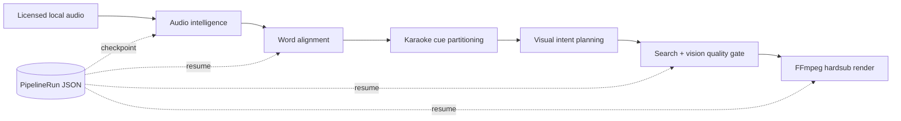

# SELMA Labs — Local Music-First Shorts Factory

## Release Summary

This release establishes one local production path that converts either a topic
or a licensed MP3/WAV into a rendered vertical MP4. Topic mode adds durable
script, source-grounded fact-check/rewrite, voice, and licensed-music-selection stages before joining the
same alignment-to-render graph used by audio mode. Unsupported scripts are
blocked before paid voice or media work. The scope intentionally stops at render completion: OAuth,
automatic publishing, cloud queues, and multi-worker coordination are not part
of this release.

The original roadmap estimated roughly 7–15 weeks for comparable scope. The
implementation was compressed through narrow vertical slices, explicit domain
invariants, adapter isolation, and testable checkpoints rather than through
skipping the hard boundaries. This is an implementation acceleration, not a
claim that production-scale cloud operations or automatic publishing have
already been delivered.

`scripts/run_factory.py` is the only production composition root.
`scripts/run_pipeline.py` is a thin compatibility alias to that same entry
point; the former parallel 1,200-line implementation has been removed.



## 1. Hexagonal Architecture: Music-First Domain and Ports

The original product direction was topic-to-TTS. The local factory moves the
core use case to source music and treats external AI/audio/video systems as
adapters around a stable domain model.

### Domain model

- `AudioAsset` is the licensed, inspected source-track representation. It
  carries the local path, measured duration, source identity, media type,
  rights metadata, and optional language/audio metadata.
- `SelectedHighlight` identifies the selected hook with asset-relative
  millisecond boundaries, selection score, hook type, selector identity, and
  rationale.
- `WordTiming` is the premium subtitle primitive: one non-empty word with
  exact millisecond start/end boundaries and optional confidence.
- `SubtitleCue` groups word timings without manufacturing timing. Its
  start/end/display text are derived from the words it owns.
- `VisualIntent` is a provider-neutral visual brief: primary keyword, mood,
  motion type, forbidden concepts, supporting concepts, exact time bounds,
  narrative role, and shot type. Pexels, NVIDIA Vision, or a future stock
  provider never leaks into this value object.
- `PipelineRun` is the aggregate root for durable execution state. It owns
  lifecycle status, active stage, retry budget, failure reason, and a
  JSON-safe artifact manifest.

### Ports and adapters

The core depends on `AudioSourcePort`, `HighlightSelectorPort`,
`WordAlignmentPort`, `VideoSourcePort`, `VisionAnalysisPort`, `RenderPort`,
and `RunRepositoryPort`, not on vendor SDKs or process commands. Current
local adapters are:

- `LocalAudioSourceProvider` for FFprobe-backed local MP3/WAV inspection.
- `LibrosaHighlightSelector` for CPU-local energy analysis.
- `WhisperXWordAlignmentProvider` for transcription and forced alignment. In
  narrated topic mode it aligns the approved script verbatim; a supplied
  language avoids using ASR output as an alternate subtitle transcript.
- `PexelsProvider` plus `VideoSearchService` and local filesystem storage.
- `NvidiaVisionProvider` plus FFmpeg frame extraction.
- `FfmpegRenderProvider` for vertical composition, ASS burn-in, and muxing.
- `LocalJsonRunRepository` for development-time durable state.

This division keeps policy inside the domain/application layers. Replacing a
catalog API, a vision model, or a renderer is an adapter/composition-root
change rather than a rewrite of music, caption, or orchestration policy.

### Time-coded storyboard policy

Visual intents form a complete edit decision list. A 1.5-second opening beat
prioritizes the hook, early beats stay dense, later beats are capped at 3.2
seconds, and the final beat closes as the payoff. A rotating shot grammar
(macro, establishing, tracking, detail, overhead, and low-angle) prevents a
sequence of visually identical stock shots. Search includes this cinematography
context, vision scoring audits it, and the selected durations are passed through
`RenderPort` into the single-pass FFmpeg graph. Fresh vision-approved assets are
preferred over reuse, with reuse allowed only when the provider offers no viable
alternative.

## 2. Single-pass narration and licensed-music mix

Topic mode uses `MusicDirectorService` to choose a theme from the verified
script and storyboard mood. `LocalLicensedMusicProvider` will return a track
only when the file, attribution, and license are all present in
`assets/music/license_manifest.json`. A missing or invalid library produces a
durable `narration_only` decision instead of using an unknown-rights asset.

The selected track is not pre-encoded into a temporary AAC. It crosses
`RenderPort` and enters the same final FFmpeg filter graph as the narration and
video. Narration receives a 70 Hz high-pass and gentle compression; the music
bed fades in/out and is reduced by a voice-keyed sidechain compressor while
speech is present. The combined result is normalized to -15 LUFS with a -1.5
dBTP ceiling. `--music-theme`, `--music-track`, and `--no-background-music`
provide explicit production control for topic runs.

## 3. Audio and Caption Engine

### Hook selection

`MusicIntelligenceService` acquires a source once, validates the selected
highlight against the measured asset duration and confidence policy, then
returns both the `AudioAsset` and `SelectedHighlight` for durable workflows.
The original `process_music_hook` API remains available for focused callers.

`LibrosaHighlightSelector` combines normalized RMS energy (70%) with onset
strength (30%) over a fixed-duration window. The calculation runs through
`asyncio.to_thread`, preserving event-loop responsiveness while CPU-bound
waveform analysis executes. The selected window is bounded by the real
FFprobe duration and is rejected when it cannot satisfy target-duration or
confidence policy.

### Word-level alignment and quality gates

`WhisperXWordAlignmentProvider` keeps model loading and inference behind a
thread boundary and serializes access to a local GPU/CPU model instance. It
converts WhisperX seconds to integer milliseconds and silently filters words
with missing timestamps instead of inventing timing data.

`AlignmentQualityService` then blocks premium progression when:

- no valid words remain;
- a timing is outside the selected hook;
- a leading, internal, or trailing caption gap exceeds five seconds; or
- word coverage is below the configured 20% of the selected hook.

### Karaoke ASS output

`CuePartitioningService` creates readable groups with at most four words,
punctuation boundaries, and a maximum visible duration of 2.5 seconds.
`PremiumSubtitleFormatter` derives ASS `\k` centisecond tags from the actual
`WordTiming` durations, rather than estimating timing from character counts.
Its karaoke style uses a 520px vertical margin to avoid the lower Shorts UI
zone. The renderer burns this ASS document into the final MP4.

## 4. Vision Intelligence and Quality Gates

The system no longer searches stock footage solely from arbitrary caption
words. `ScenePlanningService.plan_visual_intents` maps highlight energy into
cinematic direction:

- high energy → `energetic` and `fast-paced`;
- low energy → `melancholic` and `slow-motion`;
- intermediate energy → `reflective` and `steady`.

Each cue produces a `VisualIntent` with a searchable content keyword and a
policy that rejects text, logos, watermarks, and faces by default.

For every intent, `VideoSearchService` retrieves Pexels candidates,
`VisionAssetScoringService` extracts frames, and the vision adapter evaluates
relevance, observed mood, motion, and model confidence. Strict scoring does
not fall back to a keyword heuristic when vision analysis fails. A candidate
needs evidence-backed confidence of at least `0.60`; otherwise
`LowVisionConfidenceError`/`VisualAssetNotFoundError` blocks rendering.

This quality posture is deliberately conservative: “some footage” is not a
successful outcome. No accepted visual evidence means no autonomous render.

## 5. Durable Orchestration

### State machine and repository

`PipelineRun` uses `PENDING`, `RUNNING`, `FAILED`, and `COMPLETED` states,
tracks the active stage and retry count, and stores only JSON-safe artifacts.
`LocalJsonRunRepository` serializes the aggregate under
`.selma_runs/<run_id>.json`; writes use a temporary file plus `os.replace` so
a process interruption does not leave a partial canonical JSON document.

`RunExecutor` is the Saga/process-manager boundary. For every stage it:

1. loads the persisted aggregate;
2. returns a prior artifact without executing the operation when the stage is
   already complete;
3. checkpoints `RUNNING` before an external operation;
4. checkpoints the success artifact only after completion; and
5. records `FAILED` plus the original failure context when an operation fails.

The factory stages are `AUDIO_INTELLIGENCE`, `WORD_ALIGNMENT`,
`CUE_PARTITIONING`, `SCENE_PLANNING`, `VISION_SEARCH`, and `RENDER`.
Consequently, a render failure after visual download resumes directly from
the persisted clip paths and reruns only the render stage.

### Idempotency boundary

The executor provides **logical, stage-level idempotency** after a success
artifact is persisted. It is intentionally not a distributed exactly-once
guarantee: a process can still fail after an external side effect and before
the post-operation save. Future cloud adapters must pass `run_id` and stage
names as provider idempotency keys and use repository locking/leases when
multiple workers are introduced.

`LocalJsonRunRepository` is appropriate for one local worker. It is not a
replacement for an optimistic-locking database, queue, or workflow engine in
a concurrent deployment.

## 6. Render and Local Operation

`FfmpegRenderProvider.render_shorts` accepts the original audio, exact hook
bounds, ASS path, selected clip paths, and output path. It:

1. probes source audio and selected footage;
2. normalizes vertical clips and cycles footage when needed to cover the hook;
3. concatenates normalized video;
4. trims/muxes only the selected audio interval;
5. hard-burns ASS karaoke captions; and
6. verifies that a non-empty MP4 was produced.

The local composition root in `scripts/run_factory.py` wires all adapters,
services, repository, and `PipelineOrchestrator`. It deliberately contains
configuration and dependency construction only; selection, quality, retry,
and stage policy remain outside the CLI.

### Running the factory

Install dependencies, configure `.env`, and provide at least
`PEXELS_API_KEY` and `NVIDIA_API_KEY`. FFmpeg/FFprobe must be available on
the local `PATH`; Librosa and WhisperX are required for the audio stages.

```powershell
.\.venv\Scripts\python.exe scripts\run_factory.py --audio-path .\sarki.mp3
```

The command emits the final MP4 path in green. To resume a failed run, use
the `run_id` found in `.selma_runs/`:

```powershell
.\.venv\Scripts\python.exe scripts\run_factory.py `
  --audio-path .\sarki.mp3 `
  --run-id <UUID>
```

Optional `--target-duration-ms`, `--run-directory`, and
`--output-directory` flags control hook length and local artifact locations.

## Validation Status and Operating Constraints

The implementation includes unit scenarios for domain invariants, provider
errors, cue partitioning, vision confidence gating, JSON rehydration,
orchestration resume behavior, and FFmpeg Shorts rendering. In the current
development environment, syntax/import checks and a real FFmpeg looped
hardsub render completed successfully. The full pytest suite must still be
run from the project virtual environment after installing requirements.

Known operational constraints are intentional for this local release:

- WhisperX performance and lyric accuracy depend on language, vocal clarity,
  CPU/GPU capacity, and source mix quality.
- NVIDIA Vision and Pexels remain external API dependencies; their quota and
  availability determine whether a new `VISION_SEARCH` stage can complete.
- JSON state is single-worker durable state, not cloud-grade coordination.
- Manual YouTube upload is the defined delivery boundary; no OAuth token or
  automatic publishing surface is included.

The architecture is therefore ready for local factory operation while
preserving clean seams for future database, queue, object-storage, alternate
vision, and publisher adapters.
